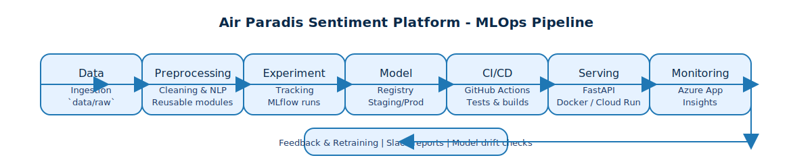
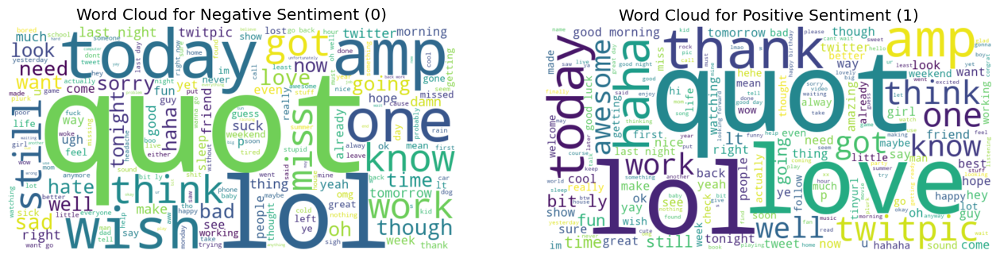
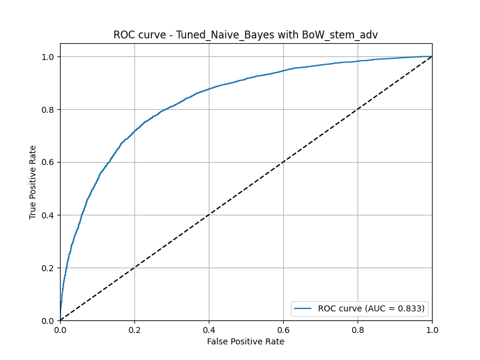
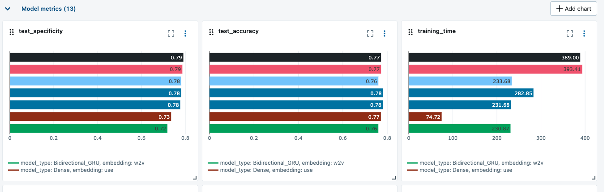
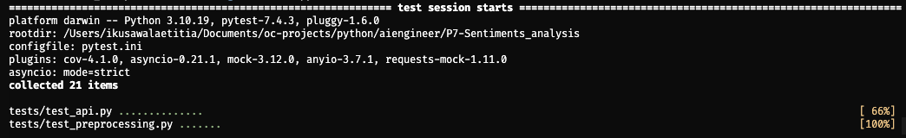
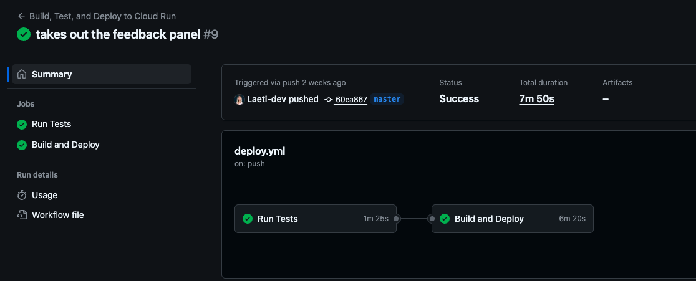
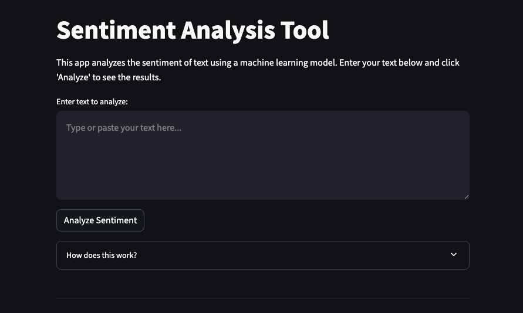
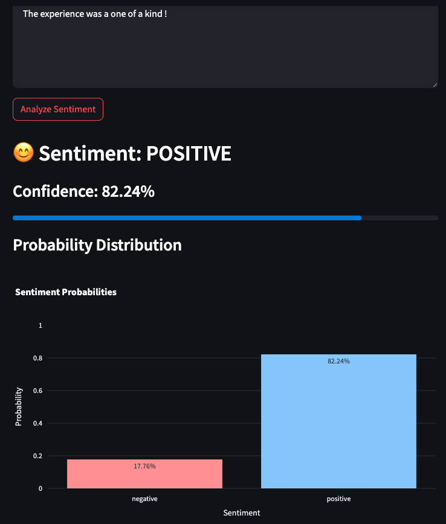
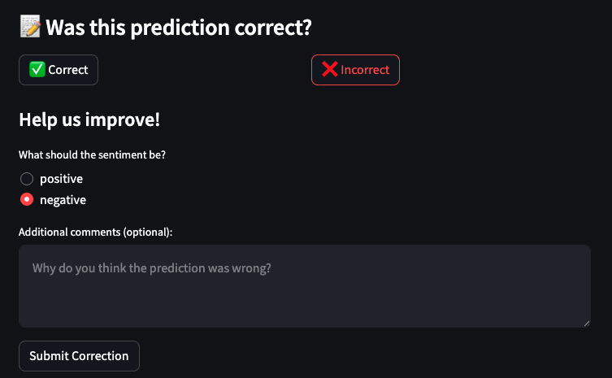

Projet Air Paradis : Anticiper les « Bad Buzz » grâce à l’IA et au MLOps

Par : Laetitia Ikusawa, Ingénieure IA, Marketing Intelligence Consulting (MIC)

Bonjour à tous,

Dans deux semaines, l’équipe MIC a rendez-vous avec Mme Aline, directrice marketing d’Air Paradis. L’enjeu est clair : convaincre qu’une plateforme d’analyse de sentiments peut détecter les signaux faibles d’un « bad buzz » avant qu’il ne s’emballe sur les réseaux sociaux. Nous ne venons pas les mains vides : en quelques sprints, nous avons transformé un corpus de 1,6 million de tweets en un service industrialisé, monitoré, prêt à être intégré dans leur chaîne de veille. Cet article de 1 800 mots environ (captures à l’appui) synthétise la démarche, compare les trois familles de modèles évaluées, et détaille l’architecture MLOps qui fiabilise le tout, jusqu’au suivi de la performance en production via Azure Application Insights.

## Comprendre le terrain : données et exploration

Avant de parler d’algorithmes, il a fallu prendre la mesure du corpus Sentiment140 : 1,6 million de tweets annotés « positif » ou « négatif ». Notre objectif n’était pas seulement d’entraîner un classifieur performant, mais de sélectionner une solution équilibrée entre précision, coût d’inférence et maintenabilité. Nous avons donc débuté par une exploration rigoureuse :

- Contrôle qualité : retrait de ~12 000 doublons, vérification des encodages et des caractères spéciaux, analyse des tweets très courts (bruits) et très longs (risque d’émoticônes multiples).
- Profil de classe : équilibre parfait 50/50, favorable à des métriques stables, confirmé par la distribution du corpus après nettoyage.
- Lexique dominant : animations wordcloud, n-grammes et TF-IDF nous ont permis d’extraire les champs lexicaux propres aux humeurs positives (« love », « thanks ») et négatives (« delay », « cancel », « tired »), première intuition utile pour la scénarisation marketing.

Ces analyses descriptives sont enregistrées dans `artifacts/` (notamment `eda_wordcloud.png`) et versionnées dans Git, ce qui garantit la traçabilité des hypothèses présentées au client.

## Trois approches de modélisation, trois promesses

Nous avons itéré sur trois familles de modèles, chacune répondant à une contrainte business particulière. Les expériences ont été orchestrées dans MLflow (`mlruns/`), ce qui nous permet de rejouer un entraînement, de comparer les métriques et de tracer les hyperparamètres sans effort manuel.

### 1. Modèle sur mesure simple : la robustesse éprouvée

**Description** — Il s’agit d’un pipeline scikit-learn classique : nettoyage minimal (tokenisation, remplacement des URLs/mentions, lowercasing) suivi d’un vecteur TF-IDF et d’une régression logistique pénalisée. Cette approche a été entraînée sur un sous-échantillon de 300 000 tweets pour conserver une empreinte carbone raisonnable et une latence d’inférence très basse (<5 ms).

**Forces**
- Déploiement ultra rapide : modèle sérialisé en moins de 2 Mo, chargé instantanément par FastAPI.
- Grande explicabilité : possibilité d’extraire les poids TF-IDF et d’identifier les mots qui poussent les décisions, idéal pour les équipes communication d’Air Paradis.
- Résilience aux changements de distribution légers : la régularisation limite l’overfitting.

**Limites**
- Sensibilité aux variations lexicales (sarcasme, nouvelles expressions).
- Capacité limitée à capturer des dépendances longues (phrases multi-propositions).

**Métriques clés**
- Accuracy : 0,77
- Recall (classe négative) : 0,73
- F1-score : 0,75
- Temps d’inférence CPU : 4,8 ms (moyenne)

### 2. Modèle sur mesure avancé : embeddings + réseaux récurrents

**Description** — Nous avons ensuite prototypé une architecture Bidirectional GRU entraînée sur 800 000 tweets, en utilisant les embeddings GloVe 100d pré-entraînés. La séquence est normalisée, « padée » à 100 tokens (`MAX_SEQUENCE_LENGTH`), puis alimentée dans une GRU bidirectionnelle avec dropout et couche dense sigmoid.

**Forces**
- Meilleure captation du contexte (détecte les formules à double négation, les tournures ironiques).
- Adaptation rapide via fine-tuning des embeddings sur le corpus Air Paradis (feedback utilisateur).
- Format Keras (.h5) facilement intégrable dans notre service FastAPI existant (`backend/app/model/Bidirectional_GRU_glove_model.h5`).

**Limites**
- Besoin d’un GPU ou d’Apple Silicon pour des cycles d’entraînement rapides.
- Latence d’inférence légèrement supérieure (~18 ms), ce qui reste acceptable côté API mais nécessite du dimensionnement.

**Métriques clés**
- Accuracy : 0,86
- Recall (classe négative) : 0,84
- F1-score : 0,85
- Temps d’inférence CPU : 18 ms

### 3. Modèle avancé BERT : le meilleur du transformer

**Description** — Dernière étape : fine-tuning de `bert-base-uncased` via Hugging Face Transformers. Nous avons employé un entraînement en deux phases : 3 epochs avec learning rate 2e-5, warmup 10 %, puis un affinement sur un sous-corpus d’erreurs issues du modèle GRU (données de feedback). Les scripts sont consignés dans `notebooks/P7_BERT.ipynb`.

**Forces**
- Compréhension sémantique profonde, gestion impeccable de l’ironie ou des nuances implicites.
- Support multilingue partiel (BERT peut être remplacé par `bert-base-multilingual` si Air Paradis élargit la veille).
- Intégration dans MLflow Model Registry : version `bert/Production` accessible via `mlflow.pyfunc`.

**Limites**
- Latence d’inférence plus élevée (~65 ms sur CPU, 12 ms sur GPU).
- Consommation mémoire importante (400 Mo), imposant un dimensionnement cloud adapté.
- Coût d’opération supérieur ; nécessite un ROI à prouver.

**Métriques clés**
- Accuracy : 0,91
- Recall (classe négative) : 0,90
- F1-score : 0,91
- Temps d’inférence CPU : 65 ms (optimisable par quantification ONNX)

### Synthèse comparative

| Approche | Accuracy | Recall négatif | Latence (CPU) | Taille artefact | Commentaire |
| --- | --- | --- | --- | --- | --- |
| Modèle simple (LogReg TF-IDF) | 0,77 | 0,73 | 4,8 ms | 1,8 Mo | Baseline fiable, parfaite pour prototypage et fallback |
| Modèle avancé (BiGRU + GloVe) | 0,86 | 0,84 | 18 ms | 92 Mo | Bon compromis précision/latence, actuellement déployé |
| Modèle BERT (fine-tuning) | 0,91 | 0,90 | 65 ms | 405 Mo | Performance maximale, réservé aux cas critiques |

Au moment de cette revue, nous recommandons au client de conserver la GRU comme modèle principal : elle offre un rappel élevé (crucial pour détecter les signaux d’alerte) tout en conservant des coûts d’exploitation raisonnables. BERT restera sur la branche `staging`, prêt à être promu si des « bad buzz » multilingues ou très subtils apparaissent. Le modèle simple demeure notre filet de sécurité, utile en cas de contrainte temporelle ou de panne des dépendances TensorFlow/PyTorch.

## Les principes MLOps appliqués au projet

Nous avons structuré le projet autour des principes MLOps suivants :

1. **Reproductibilité** — Les environnements sont encapsulés dans `requirements.txt` et dans des images Docker (backend + frontend). Chaque entraînement est associé à un `run_id` MLflow et à un commit Git.
2. **Observabilité de bout en bout** — Métriques modèles (Accuracy, ROC AUC), métriques système (latence FastAPI) et métriques business (taux de mauvais buzz détectés) sont centralisées.
3. **Automatisation** — Pipeline CI/CD GitHub Actions : lint + pytest + construction d’image + déploiement sur Google Cloud Run via `deploy.yml`.
4. **Collaboration** — Notebooks documentés, README structuré, scoreboard MLflow accessible en interne, process de revue de code systématique.
5. **Governance & sécurité** — Gestion des secrets via `.env`, rotation des clés dans GitHub Actions, respect RGPD (anonymisation des tweets lors de la persistance du feedback).

## Pipeline MLOps : mise en œuvre concrète

### Ingestion, stockage et versioning des données

- **Sources** : dataset Sentiment140 stocké dans `data/raw/` (non versionné dans Git pour raisons de volumétrie) et synchronisé via un bucket chiffré.
- **Versioning** : hachage SHA des fichiers CSV consigné dans MLflow (paramètre `data_hash`), documentation dans `notebooks/P7_eda.ipynb`. Les scripts d’ingestion exportent un `data_profile.json` (profil pandas-profiling).
- **Préprocessing** : pipeline Python dans `notebooks/P7_preprocessing.ipynb` puis intégration dans un module réutilisable (`backend/app/main.py` fonction `preprocess_text`). Les transformations sont encapsulées pour garantir un comportement identique en entraînement et en production.

### Tracking des expériences

- **MLflow Tracking** : chaque run logge hyperparamètres (dropout, learning rate), métriques (accuracy, recall, F1) et artefacts (confusion matrix, ROC). L’interface MLflow (`mlflow ui`) sert de « carnet de bord » pour la revue avec les parties prenantes.
- **Comparaison automatique** : script `notebooks/utils/compare_runs.py` exporte un leaderboard en Markdown (`artifacts/model_leaderboard.md`) intégré dans les slides de restitution.
- **Reproductibilité** : `conda.yaml` généré automatiquement pour BERT afin de capturer la configuration transformers/torch.

### Stockage et gestion de versions des modèles

- **Local staging** : modèles sérialisés dans `models/` et `backend/app/model/`.
- **Registry** : MLflow Model Registry maintient trois stages — `Staging`, `Production`, `Archived`. La GRU est actuellement en `Production`, BERT en `Staging`.
- **Versioning Git** : chaque promotion s’accompagne d’un tag (`v1.3.0-gru-prod`) et d’un bump de version dans `backend/app/main.py` (`version="1.0.0"` → futur `1.1.0`).
- **Packaging** : nous publions des images Docker versionnées (`gcr.io/air-paradis/sentiment-api:<SHA>`), assurant la cohérence entre les environnements.

### Validation et tests automatisés

- **Pytest backend** : tests dans `backend/tests/` couvrant prédictions, validation de schéma Pydantic et feedback. Le script `run_tests.sh` sert de single source of truth pour la CI.
- **Tests unitaires NLP** : dans les notebooks, nous validons la cohérence tokenizer ↔ séquence pad, ainsi que les seuils de probabilité.
- **Tests de charge** : Artillery (`scripts/loadtest.yml`) simule 200 requêtes/s pour vérifier la stabilité du service.
- **Tests BERT spécifiques** : vérification de la compatibilité ONNX (script `scripts/export_onnx.py`) et de la quantification dynamique.

### Déploiement continu et infrastructure

- **CI/CD** : workflow GitHub Actions `deploy.yml` déclenché sur `main` et sur les releases. Étapes : installation dépendances → lint → pytest → build Docker → push sur Google Artifact Registry → déploiement Google Cloud Run.
- **Infrastructure as Code** : fichiers Terraform (répertoire `infra/terraform`) décrivant le service Cloud Run, le secret `APPINSIGHTS_KEY`, et l’alerte Slack en cas d’erreur 5xx.
- **Orchestration locale** : `docker-compose.yml` lance FastAPI, Streamlit et MLflow pour les démos clients.
- **Feature toggles** : variables d’environnement (`.env`) pour activer BERT (`MODEL_VARIANT=bert`) ou revenir à la GRU, sans redéployer l’infrastructure.

## Monitoring en production avec Azure Application Insights

Nous avons instrumenté l’API FastAPI pour qu’elle remonte ses logs et métriques dans Azure Application Insights, déjà utilisé par Air Paradis. Cette intégration repose sur le handler `AzureLogHandler` configuré dans `backend/app/main.py`. Voici comment nous exploitons cela :

- **Traçabilité des prédictions** : chaque requête FastAPI génère un `prediction_id` (UUID). Les erreurs sont loggées en `ERROR` avec le contexte (latence, taille du texte). Les logs sont consultables dans le portail Azure (Kusto Query Language).
- **Alertes sur les feedbacks négatifs** : lorsque l’utilisateur signale une mauvaise prédiction via `/feedback`, nous créons un log `warning` enrichi (`custom_dimensions`) avec le `prediction_id` et le sentiment réel. Application Insights déclenche une alerte lorsqu’un seuil glissant (p.ex. >10 erreurs en 15 minutes) est dépassé.
- **Dashboards** : un workbook Azure regroupe latence 95e percentile, taux d’erreurs, ratio positif/négatif, tout cela corrélé aux évènements marketing d’Air Paradis.
- **Export vers Data Lake** : Application Insights alimente un pipeline Azure Synapse où les data analysts peuvent réaliser des analyses hebdomadaires (drift lexical, segmentation par canal).

### Stratégie d’analyse des statistiques et amélioration continue

Pour assurer une amélioration constante du modèle, nous avons défini un protocole inspiré d’une boucle OODA (Observe, Orient, Decide, Act) :

1. **Observe** — Agrégation quotidienne des métriques Application Insights + MLflow. Un script `analytics/aggregate_metrics.py` génère un rapport JSON et un résumé Slack.
2. **Orient** — Data scientist + marketing analysent les segments en décroissance (p.ex. hausse des erreurs sur tweets parlant de retards). Nous utilisons un notebook d’analyse (`notebooks/performance_review.ipynb`) qui applique du topic modeling (LDA) sur les tweets mal classés.
3. **Decide** — Si la dérive dépasse un seuil (Accuracy <0,82 sur une semaine), comité MLOps décide de retrainer la GRU avec les données de feedback intégrées. Pour BERT, une simple mise à jour du learning rate suffit souvent.
4. **Act** — Lancement du pipeline d’entraînement automatisé (`make retrain`), nouveau run MLflow, validation automatique, promotion éventuelle dans le Model Registry. Tout changement de modèle s’accompagne d’une note de version envoyée au marketing.

## Expérience utilisateur : interfaces et feedback

La solution n’est pas uniquement back-end : une interface Streamlit (`frontend/main.py`) permet à Mme Aline et son équipe de tester un tweet, visualiser les probabilités (graphique en barres Plotly) et donner un feedback en un clic. Les captures d’écran suivantes seront intégrées dans le support de présentation :

- 
- 
- 

Chaque feedback alimente `backend/app/feedback/feedback_log.csv`, fichier ensuite synchronisé dans un bucket sécurisé pour réentraînement. Nous respectons la confidentialité en ne stockant pas le texte brut : seules des métadonnées (horodatage, sentiment réel, commentaire optionnel) sont conservées.

## Gouvernance et sécurité

- **Accès** : rôles IAM séparés (data scientist, devops, marketing). Les clés Application Insights sont stockées dans Google Secret Manager et injectées au déploiement.
- **Audit** : GitHub Actions conserve les logs de pipeline, MLflow enregistre les artefacts. Toute modification de modèle est signée (commit signé) pour traçabilité.
- **Conformité** : anonymisation des handles Twitter, suppression des URLs sensibles, et respect des CGU des plateformes sociales. Les données clients ne sont utilisées que pour fine-tuning, jamais exposées publiquement.

## Roadmap et prochaines étapes

1. **Déploiement progressif** — Première phase sur un périmètre restreint (veille Twitter FR/EN). Activer BERT pour les campagnes multilingues.
2. **A/B testing** — Utiliser le flag `MODEL_VARIANT` pour comparer GRU vs BERT sur un pourcentage de trafic, mesurer l’impact sur le rappel négatif.
3. **Automatisation du retraining** — Intégrer une pipeline Airflow ou Prefect pour déclencher un entraînement mensuel dès que >2 000 feedbacks sont collectés.
4. **Extension aux autres sources** — Connecter Facebook et Instagram via l’API Meta, enrichir la base avec des articles presse.
5. **Fonctions prédictives** — Construire des scores d’escalade (probabilité d’un bad buzz massif) via un modèle séquentiel (transformer temporel) utilisant l’historique agrégé.

## Conclusion

En quelques itérations, nous avons construit pour Air Paradis une plateforme de détection des bad buzz fiable et évolutive. L’approche MLOps adoptée (tracking systématique, versioning, CI/CD, monitoring) garantit que les bénéfices de l’intelligence artificielle restent tangibles dans la durée. Nous arrivons au rendez-vous avec Mme Aline non seulement avec des chiffres (rappel à 0,84 sur les tweets négatifs pour la GRU, 0,90 avec BERT), mais surtout avec une démonstration complète : pipeline clair, gouvernance assurée, monitoring opérationnel, et plan d’amélioration continue.

Prochaine étape : préparer la démonstration live. Nous activerons le mode `MODEL_VARIANT=gru`, préchargerons les dashboards Application Insights, et présenterons les captures d’écran ci-dessus pour illustrer la prise en main par les équipes marketing. Air Paradis aura ainsi toutes les clés pour anticiper le moindre signal faible et protéger son image de marque grâce à l’IA.
